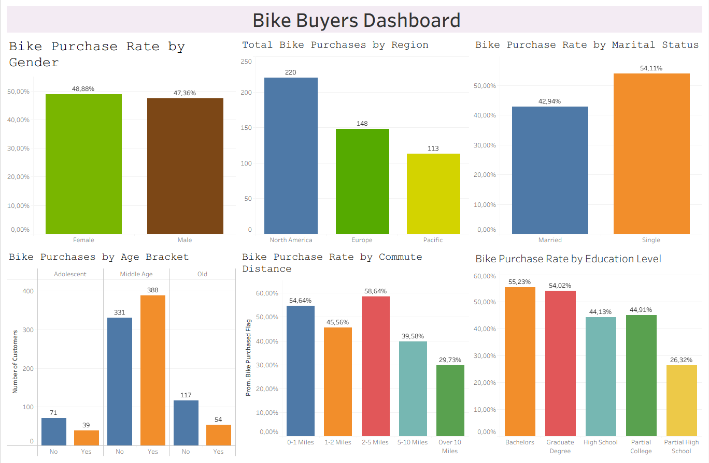

# Bike Buyers Dashboard with Excel and Tableau

## Project Overview

This project analyses bike buyer behaviour using Excel and Tableau.

The dataset was cleaned and prepared in Excel, then used to build dashboards in both Excel and Tableau. The objective was to practise the full BI workflow: data cleaning, pivot table analysis, dashboard design and data visualisation using two different tools.

## Tools Used

- Excel
- Tableau
- GitHub

## Dataset

The dataset contains customer information related to bike purchases, including demographic and behavioural variables such as:

- Gender
- Region
- Marital status
- Income
- Number of children
- Education level
- Occupation
- Home ownership
- Number of cars
- Commute distance
- Age
- Bike purchase status

## Dataset Versions

This repository includes different versions of the dataset:

- `data/raw/raw_bike_buyers_dataset_original.xlsx`: original dataset before any cleaning or formatting changes.
- `data/raw/raw_bike_buyers_dataset_github_preview.csv`: GitHub-friendly version of the raw dataset. Only formatting changes were applied so that GitHub can preview the file correctly.
- `data/cleaned/cleaned_bike_buyers_dataset.csv`: final cleaned dataset used to build the Excel and Tableau dashboards.

## Note About the Raw Dataset

The original dataset uses regional number formatting in the Income column, for example values such as `$40.000,00`.

When exporting this type of file to CSV, the combination of semicolon separators and comma decimal formatting can prevent GitHub from displaying the dataset correctly as a table.

For this reason, I included a GitHub-friendly raw preview file. This version only applies minimal formatting changes, such as delimiter conversion and income formatting, to make the file readable in GitHub.

No analytical cleaning or category standardisation was applied to the GitHub preview version.

## Project Objective

The main objective was to understand which customer segments were more likely to purchase a bike and to communicate the findings through clear dashboards.

This project also helped me practise recreating a similar dashboarding workflow in two different tools: Excel and Tableau.

## Workflow

1. Reviewed the original raw dataset.
2. Created a cleaned working sheet in Excel.
3. Standardised categorical values such as marital status and gender.
4. Cleaned income values and prepared them for analysis.
5. Created an age bracket column to group customers by age segment.
6. Built pivot tables to explore purchase behaviour.
7. Created an Excel dashboard.
8. Recreated the dashboard in Tableau to practise BI visualisation with another tool.
9. Compared purchase patterns across different customer segments.

## Dashboard Preview

## Key Insights

- Female customers showed a slightly higher bike purchase rate than male customers.
- North America had the highest total number of bike purchases.
- Single customers had a higher bike purchase rate than married customers.
- Middle-aged customers represented the strongest purchasing group.
- Customers with a commute distance of 2-5 miles had the highest purchase rate.
- Customers with Bachelors and Graduate Degree education levels showed higher purchase rates compared with other education groups.

## Skills Demonstrated

- Excel data cleaning
- Pivot tables
- Dashboard design
- Tableau visualisation
- Data storytelling
- Customer segmentation
- Business insight generation
- Data preparation for BI tools
- CSV formatting for GitHub preview

## Files Included

- `data/raw/raw_bike_buyers_dataset_original.xlsx`: original dataset.
- `data/raw/raw_bike_buyers_dataset_github_preview.csv`: raw dataset converted into a GitHub-friendly CSV format.
- `data/cleaned/cleaned_bike_buyers_dataset.csv`: cleaned dataset used for analysis and dashboard creation.
- `excel/bike_buyers_excel_dashboard.xlsx`: Excel workbook containing the working sheet, pivot tables and dashboard.
- `tableau/bike_buyers_tableau_dashboard.twbx`: Tableau dashboard workbook.
- `images/bike_buyers_excel_dashboard.png`: Excel dashboard preview image.

## Conclusion

This project helped me practise the full BI workflow, from data cleaning and preparation to dashboard creation and insight communication.

By building the dashboard in both Excel and Tableau, I was able to practise similar analysis and visualisation tasks using two different tools commonly used in data analyst and business intelligence roles.
